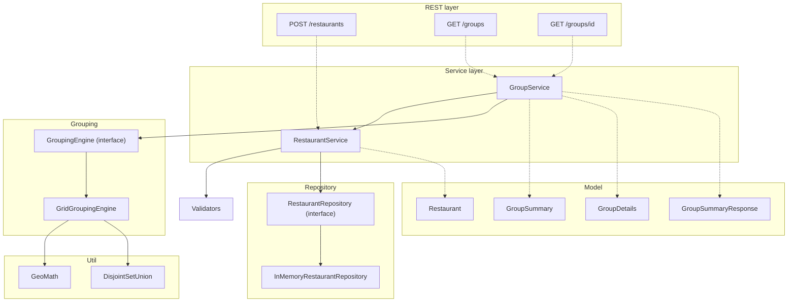

# Delivery zone consolidator service
A service that groups restaurants into connected delivery zones and returns deterministic target circles for ad targeting.

## What this service does
- Accepts a full restaurant list and replaces the current in-memory dataset.
- Computes connected groups where delivery circles overlap(directly or transitively).
- Returns deterministic group IDs and stable output ordering for repeatable results.
- Exposes Swagger docs for easy exploration and testing.

## Architecture Diagram



Dashed arrows mark dependencies not yet wired up (the REST controllers) or plain data usage (models); solid arrows are real service-to-service calls.

### Layer responsibilities

- **Service** — `RestaurantService` owns write validation and the version counter used for cache invalidation; `GroupService` owns the version-based group cache and response assembly.
- **Validation** — `RestaurantValidator` checks an entire upload batch and reports every violation at once, not just the first one.
- **Repository** — `RestaurantRepository` is a plain storage interface; `InMemoryRestaurantRepository` is the only implementation today, swappable later for a real datastore without touching anything above it.
- **Grouping** — `GroupingEngine` is the clustering contract; `GridGroupingEngine` is the current implementation (spatial grid + union-find, O(n) average case).
- **Util** — `GeoMath` (haversine distance) and `DisjointSetUnion` (iterative union-find) are dependency-free and reusable outside this domain.
- **Model** — immutable records for the restaurant and group API shapes.

### Key design decisions

- **Cache invalidation is version-based, not size-based.** `POST /restaurants` always fully replaces the dataset, so a naive "did the restaurant count change?" check can miss updates that swap data without changing the count. `RestaurantService` bumps a counter on every replace; `GroupService` compares against it in O(1).
- **The group cache uses a synchronized double-checked lock, not a lock-free `AtomicReference`.** Storage only needs atomic visibility; the cache needs "compute the expensive clustering pass at most once per version," which a bare atomic swap can't guarantee under concurrent callers.
- **Group IDs are `g1, g2, ...`, assigned after sorting clusters by target location.** Deterministic for a given dataset, human-readable, and matches the spec's own example response — not a hash of group membership, which is equally deterministic but unreadable.

## Quick Start

### Prerequisites
- Java 25
- Maven

### Run Locally
```powershell
mvn spring-boot:run
```

- Service base URL : `http://localhost:8080`
- Swagger UI : `http://localhost:8080/swagger-ui/index.html`

##### Link to Google Slides - [Delivery Consolidator Service](https://docs.google.com/presentation/d/e/2PACX-1vQPNk9BRm3zxxTrRlIJK4UnX7_Zj4b17TLYTxL3fs_QaLTB3GiEB6he_pbU5Tab6M0BfeflCMlQ84sP/pub?start=false&loop=false&delayms=3000)